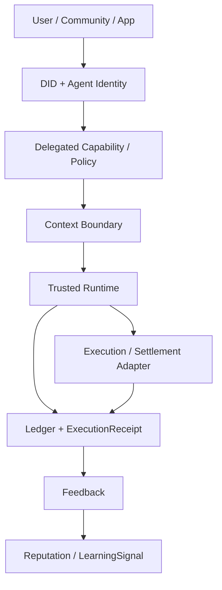

# Luffa Fabric

> DEMO use only. This repository packages the current Luffa Fabric MVP v0.3 as a public interactive demo.

**Verifiable Adaptive Resource Runtime for the agentic economy: off-chain execution, on-chain verifiability, and on-chain value execution.**

Luffa Fabric is the runtime fabric for context-bounded and wallet-connected AI agents. It gives developers the primitives to map external agents to DIDs, issue scoped capability grants, enforce context and value boundaries, run trusted workflows, record execution evidence, settle through resource or value rails, and turn feedback into reputation or learning-ready signals.

Built by **Luffa AI Research Lab**.

> Formerly referred to as **LAEL**. Compatibility names such as `LAEL` and `LAEL_*` are intentionally preserved for earlier callers.

## Public Demo

Target public deployment:

| Surface | URL |
| --- | --- |
| Frontend | `https://luffa-fabric-mvp-demo.vercel.app` |
| API | `https://luffa-fabric-mvp-api.onrender.com` |
| Public callback | same as API |

The frontend is intended for Vercel and the API is intended for Render. See [DEPLOYMENT.md](./DEPLOYMENT.md) for setup and [DEMO_TESTING.md](./DEMO_TESTING.md) for public smoke and wallet checks.

Demo boundaries:

- The public demo does not use local Cloudflare Tunnel.
- QR `/scan` and `/callback` URLs must use the Render API domain.
- QA Runner is localhost-only and disabled in public production.
- Mainnet execution is enabled for controlled small-value testing, but still requires UI risk confirmation, amount cap, wallet confirmation, and real txHash.
- `mock_` txHash or signed-only authorization must never be described as real chain completion.

Quick local check:

```bash
npm install
npm run typecheck
npm test -- tests/docs.test.ts tests/project-docs.test.ts tests/frontend-wallet-menu.test.ts
npm run build
cd src/frontend && npm install && npm run build
```

## The Thesis

AI agents are beginning to act for users, teams, applications, communities, and protocols. The hard part is not only connecting them to tools. The hard part is proving:

- who the agent is
- who authorized it
- what it is allowed to do
- what context it may read
- which wallet or rail is allowed to settle
- whether risk and approval rules were enforced
- what evidence proves the outcome
- how feedback changes reputation and future learning

Luffa Fabric is the connector layer for that trust loop. The v0.3 MVP is a unified runtime MVP with two acceptance paths:

- **Off-chain Agent Execution** for OpenClaw, Hermes, Claude Code, Codex, and API agents.
- **On-chain Value Execution** for transfer, trading/swap proposal, settlement, reward, claim, and payment.

```text
Identity
  -> Wallet Binding
  -> Delegated Permission
  -> Context Boundary
  -> Trusted Execution
  -> Settlement / Resource Accounting
  -> Ledger / Receipt
  -> Feedback
  -> Reputation / Learning Signal
```

It is not a marketplace, bridge, MPC wallet, account-abstraction stack, zkML runtime, TEE system, DAO, or full decentralized protocol. Those surfaces are deliberately reserved for future phases.

## Architecture At A Glance



## What Is Included

| Layer | Capability |
| --- | --- |
| Identity | DID-style owner references, agent registration, service keys, delegated capability tokens |
| Wallets | Wallet connect nonce flow, signature verification, DID-to-wallet binding |
| Permission | Default-deny policy engine with action, risk, budget, asset, chain, expiry, and revocation checks |
| Context | MVP1 VARR context resources, namespace isolation, public-scope enforcement |
| Execution | Agent invocation pipeline plus trusted VARR runtime sidecar |
| Settlement | Luffa Points, EVM native, EVM ERC20, Solana native, Solana SPL, Endless adapter abstraction, fiat/invoice proof rails |
| Evidence | Execution ledger, settlement records, Merkle fields, and VARR `ExecutionReceipt` |
| Feedback | Feedback submission, reputation scoring, and learning-ready signal emission |
| API | Phase 1 v1 APIs, MVP 2 wallet and settlement APIs, VARR sidecar API |
| Demo | Wallet demo scaffold plus community summary trusted-agent demo |
| QA | Unit, integration, E2E, wallet, settlement, ledger, and security tests |

## VARR Trusted Agent Runtime

The newest addition is **VARR MVP1: Trusted Agent Execution Loop**, an overlay runtime under `varr-mvp1/`.

VARR proves the smallest structurally correct trusted-agent path:

```text
One Agent
-> One DID
-> One Capability
-> One Context Boundary
-> One Workflow
-> One Controlled Execution
-> One ExecutionReceipt
-> One Feedback Signal
-> Zero Private-Key Exposure
```

The runtime is intentionally small and strict:

- `RuntimeOrchestrator` is the only execution path.
- Adapters cannot execute without runtime authorization.
- Every path creates an `ExecutionReceipt`, including denied and pending approval paths.
- Critical actions are hard-denied before adapter execution.
- High-risk actions return `pending_approval`.
- Feedback must reference a valid receipt.
- Learning signals are emitted only from receipt plus feedback.
- Seed phrases, private keys, mnemonics, and raw wallet credentials are never accepted or stored.

VARR is not a replacement for Luffa Core. It is a sidecar runtime that can consume Luffa identity, community, wallet intent, and event abstractions without invasive core changes.

## Supported Wallets

- Coinbase Wallet
- MetaMask
- OKX Wallet
- WalletConnect v2
- Phantom
- Luffa Wallet

Luffa Fabric never stores user mnemonics, seed phrases, master private keys, or raw wallet private keys. Wallet ownership is external and is proven by signing scoped wallet-binding messages.

## Supported Chains

| Chain key | Type | Network |
| --- | --- | --- |
| `BASE_MAINNET` | EVM | Base Mainnet |
| `BASE_SEPOLIA` | EVM | Base Sepolia |
| `ETHEREUM_SEPOLIA` | EVM | Ethereum Sepolia |
| `POLYGON_AMOY` | EVM | Polygon Amoy |
| `SOLANA_DEVNET` | Solana | Solana Devnet |
| `ENDLESS_TESTNET` | Endless | Endless-compatible testnet adapter |

Configuration details live in [CHAIN_CONFIGURATION.md](./CHAIN_CONFIGURATION.md).

## Settlement Rails

Luffa Fabric keeps the core chain-agnostic. The execution engine emits `SettlementInstruction`; concrete chain behavior lives behind adapter interfaces.

```ts
export interface SettlementAdapter {
  chainType: string;
  getBalance(address: string): Promise<string>;
  transfer(input: SettlementTransferInput): Promise<SettlementTransferResult>;
  verifyTransaction(txHash: string): Promise<TransactionVerification>;
  estimateFee(input: SettlementTransferInput): Promise<string>;
}
```

Implemented rails:

- `luffa-points`
- `evm-native`
- `evm-erc20`
- `solana-native`
- `solana-spl`

The EVM, Solana, and Endless adapters can run in mock mode for CI and local development. Real testnet mode is designed to skip when RPC credentials or funded test wallets are unavailable.

## Delegated Permission Model

Agents can only execute scoped actions. A capability token may include:

- `maxAmount`
- `allowedAssets`
- `allowedChains`
- `expiresAt`
- revoked or active state

Every invocation follows the same trust path:

1. Resolve owner and agent identity.
2. Verify the agent is active and declares the requested capability.
3. Validate capability token scope, expiry, revocation, amount, asset, and chain.
4. Check context boundaries when context access is requested.
5. Evaluate policy and risk.
6. Route high-risk actions to approval.
7. Deny critical actions before adapter execution.
8. Execute only after explicit authorization.
9. Record the execution outcome, including denied actions.
10. If settlement occurs, store the settlement ID and transaction hash.

Permission is default-deny. Deny rules override allow rules.

## Evidence Model

Luffa Fabric records execution and settlement evidence. VARR adds an explicit receipt primitive for trusted runtime paths.

`ExecutionReceipt` captures:

- intent ID
- agent ID
- workflow ID
- capability IDs
- context references
- context hash
- policy decisions
- risk level
- approval requirement
- status
- output hash or pointer
- cost metadata
- creation timestamp

Receipts are append-only evidence records, not casual logs.

## REST API

Phase 1 APIs are preserved:

| Method | Path | Purpose |
| --- | --- | --- |
| `POST` | `/v1/agents/register` | Register an agent |
| `POST` | `/v1/policies` | Create a permission policy |
| `POST` | `/v1/agent/invoke` | Invoke an agent action |
| `GET` | `/v1/executions/:executionId` | Read execution record |
| `POST` | `/v1/executions/:executionId/feedback` | Submit feedback |
| `GET` | `/v1/agents/:agentId/reputation` | Read reputation |

MVP 2 APIs:

| Method | Path | Purpose |
| --- | --- | --- |
| `GET` | `/v2/chains` | List chain registry |
| `POST` | `/v2/wallet/connect` | Create wallet-binding nonce |
| `POST` | `/v2/wallet/verify` | Verify signature and bind wallet |
| `GET` | `/v2/wallets/:ownerRef` | List owner wallet bindings |
| `POST` | `/v2/settlement/transfer` | Invoke settlement adapter |
| `GET` | `/v2/settlement/tx/:txHash` | Verify transaction status |

VARR sidecar APIs live under `varr-mvp1/packages/api`:

| Method | Path | Purpose |
| --- | --- | --- |
| `POST` | `/v1/agents` | Register an `AgentResource` |
| `POST` | `/v1/capabilities` | Create a `CapabilityGrant` |
| `POST` | `/v1/contexts` | Create a `ContextResource` |
| `POST` | `/v1/workflows` | Create a `WorkflowResource` |
| `POST` | `/v1/execution/run` | Run the trusted execution loop |
| `GET` | `/v1/execution/receipts/{receipt_id}` | Read an execution receipt |
| `POST` | `/v1/feedback` | Attach feedback to a receipt |
| `GET` | `/v1/learning/signals?receipt_id={receipt_id}` | Read learning-ready signals |

## Quick Start

Core Luffa Fabric:

```bash
corepack enable
pnpm install
pnpm lint
pnpm typecheck
pnpm test
pnpm build
pnpm demo
```

VARR sidecar:

```bash
cd varr-mvp1
pnpm test
pnpm demo
```

Expected VARR demo result:

```text
Execution status: success
Receipt generated: receipt_001
Feedback accepted: yes
Learning signal emitted: yes
Private key exposure: no
Context boundary respected: yes
```

## Demo Flows

Unified Runtime Fabric v0.3 demo flows:

Off-chain Runtime Agent flow:

1. Map an OpenClaw/Codex-style external agent to a LAEL Agent DID.
2. Run a public community summary through VARR `RuntimeOrchestrator`.
3. Enforce capability, context boundary, approval, and forbidden-action checks.
4. Generate `ExecutionReceipt`, feedback, and `LearningSignal`.

On-chain Value Agent transfer flow:

1. Bind a wallet to an owner DID.
2. Submit natural-language transfer input to `/v2/payment-agent/proposals`.
3. Review the parsed intent and `allow_pending_human_confirmation` decision.
4. Execute the proposal only after explicit user confirmation.
5. Generate a v0.2 receipt with raw input, parsed intent, permission decision, wallet tx, settlement result, and learning status.
6. Submit feedback to update agent score, user preference memory, policy suggestions, and training examples.
7. Submit a second shorthand request so the agent can use memory while still requiring permission checks and wallet confirmation.

On-chain simulated swap flow:

1. Submit a swap request such as `Swap 0.0001 ETH to USDC on Base Sepolia` to `/v2/value-agent/swap-proposals`.
2. Review the simulated swap intent and permission decision.
3. Execute the proposal only as a simulated receipt; no real DEX trade or wallet signature occurs.

Fiat / proof settlement flow:

1. Submit a settlement instruction using `fiat-proof`, `invoice-proof`, `resource-credit`, or `onofframp-intent`.
2. Store a proof settlement record without calling Stripe, banks, or on/off-ramp providers.

The complete v0.3备案 documents are in [`docs/`](./docs/):

- [Requirements zh](./docs/LAEL_REQUIREMENTS_v0.3.zh.md) / [Requirements en](./docs/LAEL_REQUIREMENTS_v0.3.en.md)
- [MVP zh](./docs/LAEL_MVP_v0.3.zh.md) / [MVP en](./docs/LAEL_MVP_v0.3.en.md)
- [Test Plan zh](./docs/LAEL_TEST_PLAN_v0.3.zh.md) / [Test Plan en](./docs/LAEL_TEST_PLAN_v0.3.en.md)

Core MVP 2 flow:

1. Connect Coinbase Wallet or another supported wallet.
2. Sign a DID wallet-binding message.
3. Register an agent.
4. Create a scoped policy.
5. Invoke `luffa.create_task`.
6. Trigger a Base Sepolia USDC mock settlement.
7. Save and display `txHash`.
8. Verify the transaction.
9. Write the execution ledger record.
10. Submit feedback.
11. Update reputation.

VARR MVP1 flow:

1. Register the Community Summary Agent.
2. Grant public community read and summarize capabilities.
3. Create a public community context.
4. Create a linear workflow.
5. Execute through `RuntimeOrchestrator`.
6. Generate an `ExecutionReceipt`.
7. Submit feedback.
8. Emit a `LearningSignal`.

## Test Coverage

Core Luffa Fabric test commands:

```bash
pnpm test:unit
pnpm test:integration
pnpm test:e2e
pnpm test:wallet
pnpm test:settlement
```

VARR sidecar coverage includes:

- resource validators
- capability enforcement
- expired and revoked capability denial
- context namespace isolation
- private context denial in MVP1
- low-risk successful execution
- high-risk `pending_approval`
- critical action denial
- receipt creation for every runtime path
- feedback rejection without a valid receipt
- adapter bypass protection
- seed phrase and private key material rejection

Latest VARR local verification:

- `pnpm test`: 19 tests passed
- `pnpm demo`: passed end to end

## Repository Layout

```text
src/
  api/          Fastify REST API
  chains/       Chain registry and chain config types
  core/         Compatibility orchestrator
  db/           SQLite migrations and database wrapper
  execution/    Action handlers and Merkle execution ledger
  frontend/     Next.js MVP 2 wallet demo
  identity/     Agents, service keys, delegated capability tokens
  learning/     Feedback and reputation
  mcp/          MCP server surface
  permission/   Default-deny policy evaluation
  settlement/   Luffa Points ledger and settlement adapters
  wallet/       Wallet nonce, signature verification, and DID binding

varr-mvp1/
  packages/core     Trusted runtime, resources, storage, adapters, security
  packages/api      Minimal REST API
  packages/cli      Developer CLI
  packages/sdk-js   Lightweight JavaScript client
  examples/         Community summary agent demo
  docs/             Architecture, API, security, threat model
  tests/            Unit, integration, and security tests

tests/
  e2e/          End-to-end MVP 2 flow
fixtures/       Deterministic wallet, agent, policy, and settlement fixtures
visual-demo/    Vite visual demo
```

## Configuration

See [.env.example](./.env.example) for core Luffa Fabric variables.

Important flags:

```bash
LAEL_SETTLEMENT_MODE=mock
ENABLE_EVM=true
ENABLE_SOLANA=true
ENABLE_ENDLESS=true
```

RPC and token configuration:

```bash
BASE_RPC_URL=
SEPOLIA_RPC_URL=
POLYGON_RPC_URL=
SOLANA_RPC_URL=
ENDLESS_RPC_URL=
WALLETCONNECT_PROJECT_ID=
USDC_BASE_SEPOLIA=
USDT_BASE_SEPOLIA=
```

## Security Boundaries

Luffa Fabric enforces:

- no mnemonic storage
- no seed phrase storage
- no raw user private key storage
- wallet binding through signature proof
- capability-scoped execution
- context-bound runtime access
- settlement only after permission approval
- spending caps
- chain and asset constraints
- capability expiry
- capability revocation
- idempotency keys
- transaction hash recording
- denied-action evidence records
- approval gating for high-risk actions

Security non-goals:

- no cross-chain bridge
- no MPC wallet
- no production account abstraction
- no zkML
- no TEE
- no DAO governance
- no production bridge security claims
- no production sandbox cluster in VARR MVP1

## Documentation

- [QUICKSTART.md](./QUICKSTART.md)
- [WALLET_TEST_GUIDE.md](./WALLET_TEST_GUIDE.md)
- [CHAIN_CONFIGURATION.md](./CHAIN_CONFIGURATION.md)
- [VARR MVP1 Architecture](./varr-mvp1/docs/architecture.md)
- [VARR MVP1 Security](./varr-mvp1/docs/security.md)
- [VARR MVP1 Threat Model](./varr-mvp1/docs/threat-model.md)

## License

MIT.

## Stewardship

Built and maintained by **Luffa AI Research Lab** as part of the Luffa Super Connector ecosystem.
