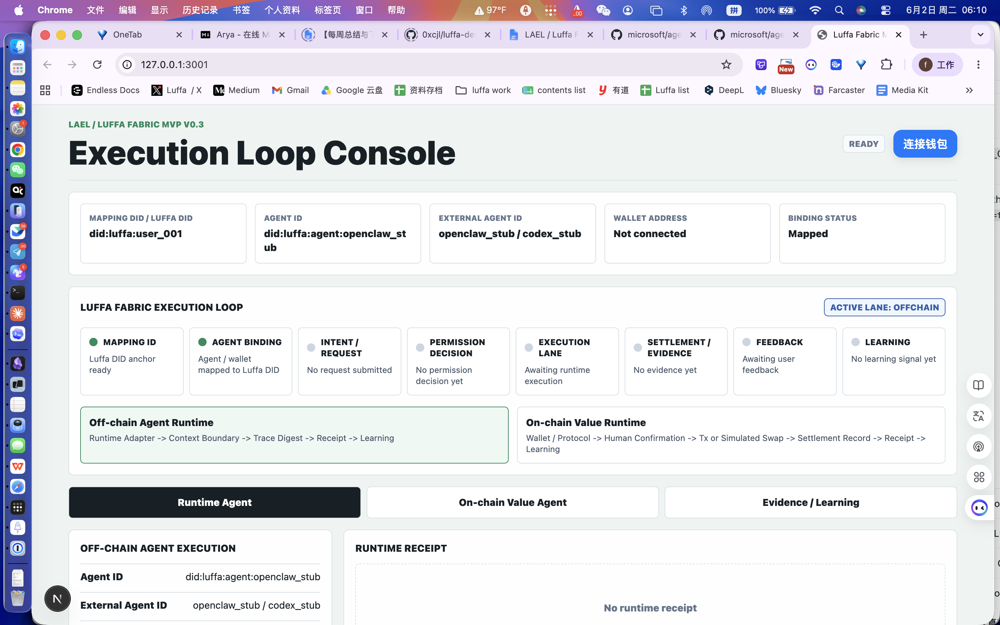
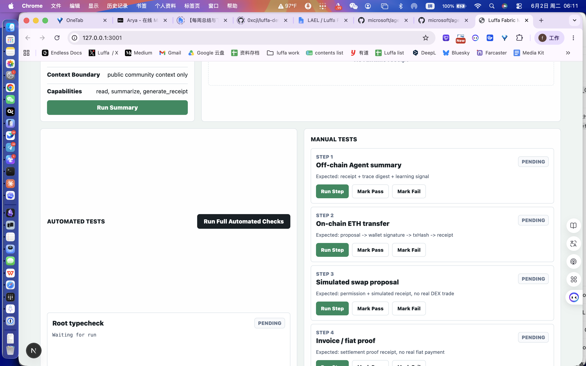
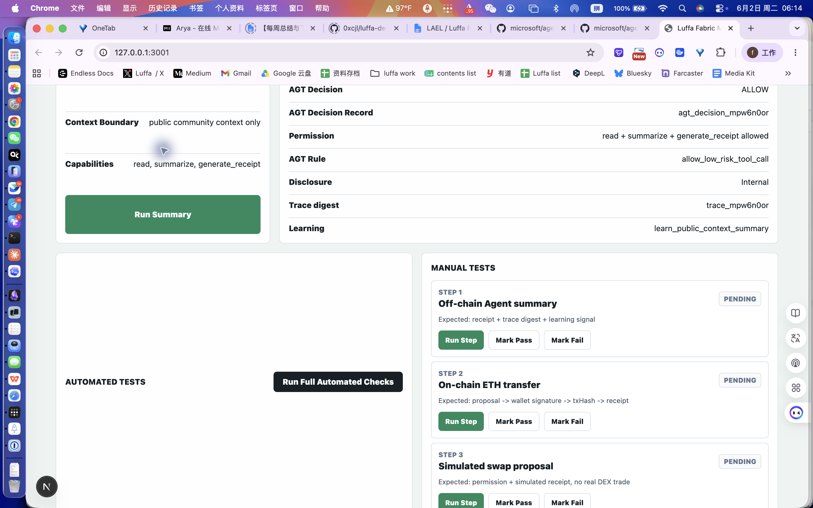

# LAEL / Luffa Fabric × Microsoft AGT 浏览器人工验收截图报告

日期：2026-06-02  
页面：`http://127.0.0.1:3001/`  
后端：`http://127.0.0.1:3000`  
范围：Execution Loop Console、Runtime Agent、Microsoft AGT Adapter evidence、Learning 展示。

## 1. 验收结论

浏览器人工验收通过。

当前前端可以清楚展示：

- Mapping DID / Luffa DID。
- Agent ID。
- External Agent ID。
- Wallet Address。
- Off-chain / On-chain execution lane。
- Runtime Agent receipt。
- Governance Source = Microsoft AGT Adapter。
- AGT Decision Record。
- Evidence disclosure。
- Learning boundary。

## 2. 服务状态

| 服务 | URL | 结果 |
| --- | --- | --- |
| LAEL API | `http://127.0.0.1:3000/v2/chains` | 返回 JSON，正常 |
| Frontend | `http://127.0.0.1:3001/` | 返回页面 HTML，正常 |

## 3. 截图资产

仓库路径：

```text
docs/assets/agt-browser-acceptance-2026-06-02/
```

Downloads 路径：

```text
/Users/xyz/Downloads/agt-browser-acceptance-2026-06-02/
```

| 截图 | 文件 | 验收内容 |
| --- | --- | --- |
| 1 | `01-initial-console.png` | 首页 Execution Loop Console，展示 Identity Mapping 和双路径执行闭环 |
| 2 | `02-runtime-panel.png` | Runtime Agent、Automated Tests、Manual Tests 面板 |
| 3 | `03-runtime-receipt-agt.png` | Run Summary 后展示 AGT Decision Record、Evidence、Learning |

## 4. 操作步骤

1. 启动 LAEL API：`http://127.0.0.1:3000`。
2. 启动前端：`http://127.0.0.1:3001`。
3. 打开前端页面。
4. 查看首屏 Identity Mapping：
   - Mapping DID / Luffa DID：`did:luffa:user_001`
   - Agent ID：`did:luffa:agent:openclaw_stub`
   - External Agent ID：`openclaw_stub / codex_stub`
   - Wallet Address：`Not connected`
5. 查看 Execution Loop：
   - Active lane：`offchain`
   - Off-chain Agent Runtime 分支高亮。
6. 点击 Runtime Agent 面板中的 `Run Summary`。
7. 查看 Runtime Receipt：
   - Governance Source：`Microsoft AGT Adapter`
   - AGT Decision：`ALLOW`
   - AGT Decision Record：`agt_decision_*`
   - AGT Rule：`allow_low_risk_tool_call`
   - Disclosure：`Internal`
8. 查看 Evidence：
   - Off-chain runtime receipt。
   - AGT decision record。
   - Anchor-ready digest。
   - Internal sensitivity。
9. 查看 Learning：
   - Execution receipt 生成 learning item。
   - 明确 boundary：receipt 本身不改变权限边界。

## 5. 验收结果

| 验收项 | 预期 | 实际结果 |
| --- | --- | --- |
| Identity Mapping 可见 | 清楚区分 Mapping DID / Agent ID / External Agent ID / Wallet | 通过 |
| Execution Loop 可见 | 显示闭环节点和 Off-chain / On-chain lane | 通过 |
| Runtime Agent 可执行 | 点击 `Run Summary` 后生成 receipt | 通过 |
| AGT Governance Source 可见 | 显示 `Microsoft AGT Adapter` | 通过 |
| AGT Decision Record 可见 | 显示 `agt_decision_*` 和 matched rule | 通过 |
| Evidence 展示 AGT record | Evidence panel 包含 AGT decision record | 通过 |
| Evidence 敏感分级 | AGT record 标记为 Internal / 仅内部 | 通过 |
| Learning 展示边界 | 显示 learning item 和不改变权限边界 | 通过 |

## 6. 截图预览

### 6.1 Initial Console



### 6.2 Runtime Panel



### 6.3 Runtime Receipt + AGT Evidence



## 7. 发现的问题

- Chrome 禁用了 AppleScript JavaScript 执行，这是浏览器安全设置，不影响产品。
- 前端 dev / build 仍有 WalletConnect / pino optional warning，属于既有 warning，不影响页面访问和构建。
- 本轮浏览器验收只覆盖 Off-chain Runtime + AGT Adapter 展示；真实 AGT sidecar 和 MCP Security Gateway 的浏览器级演示需要后续扩展 UI。

## 8. 最终结论

本轮浏览器人工验收确认：

> 当前 Luffa Fabric Execution Loop Console 已能在 UI 上清楚表达 Microsoft AGT 是 Governance Extension 的一个可选治理积木，并能把 AGT decision record 映射到 Runtime Receipt、Evidence 和 Learning 展示中。

